# Como crear Archivo

🥇 Este archivo contiene ejemplos útiles para estructurar documentación en Markdown.

---

## **Tablas**

Puedes usar tablas para organizar datos markdown nativo:

| Encabezado 1 | Encabezado 2 | Encabezado 3 |
|--------------|--------------|--------------|
| Dato 1       | Dato 2       | Dato 3       |
| Otro dato 1  | Otro dato 2  | Otro dato 3  |


tabla usando etiquetas html

<div style={{ overflowX: 'auto' }}>
  <table style={{ tableLayout: 'auto', borderCollapse: 'collapse' }}>
    <thead>
      <tr>
        <th style={{ whiteSpace: 'nowrap' }}>Encabezado 1</th>
        <th style={{ whiteSpace: 'nowrap' }}>Encabezado 2</th>
        <th style={{ whiteSpace: 'nowrap' }}>Encabezado 3</th>
        <th style={{ whiteSpace: 'nowrap' }}>Encabezado 4</th>
        <th style={{ whiteSpace: 'nowrap' }}>Encabezado 5</th>
        <th style={{ whiteSpace: 'nowrap' }}>Encabezado 6</th>
        <th style={{ whiteSpace: 'nowrap' }}>Encabezado 7</th>
        <th style={{ whiteSpace: 'nowrap' }}>Encabezado 8</th>
        <th style={{ whiteSpace: 'nowrap' }}>Encabezado 9</th>
      </tr>
    </thead>
    <tbody>
      <tr>
        <td style={{ whiteSpace: 'nowrap' }}>Dato 1</td>
        <td style={{ whiteSpace: 'nowrap' }}>Dato 2</td>
        <td style={{ whiteSpace: 'nowrap' }}>Dato 3</td>
        <td style={{ whiteSpace: 'nowrap' }}>Dato 4</td>
        <td style={{ whiteSpace: 'nowrap' }}>Dato 5</td>
        <td style={{ whiteSpace: 'nowrap' }}>Dato 6</td>
        <td style={{ whiteSpace: 'nowrap' }}>Dato 7</td>
        <td style={{ whiteSpace: 'nowrap' }}>Dato 8</td>
        <td style={{ whiteSpace: 'nowrap' }}>Dato 9 para probar el autojuste</td>
      </tr>
      <tr>
        <td style={{ whiteSpace: 'nowrap' }}>Otro dato 1</td>
        <td style={{ whiteSpace: 'nowrap' }}>Otro dato 2</td>
        <td style={{ whiteSpace: 'nowrap' }}>Otro dato 3</td>
        <td style={{ whiteSpace: 'nowrap' }}>Otro dato 4</td>
        <td style={{ whiteSpace: 'nowrap' }}>Otro dato 5</td>
        <td style={{ whiteSpace: 'nowrap' }}>Otro dato 6</td>
        <td style={{ whiteSpace: 'nowrap' }}>Otro dato 7</td>
        <td style={{ whiteSpace: 'nowrap' }}>Otro dato 8</td>
        <td style={{ whiteSpace: 'nowrap' }}>Otro dato 9</td>
      </tr>
    </tbody>
  </table>
</div>

---

## **Imágenes**

Puedes insertar imágenes con la siguiente sintaxis:


---

## **Enlaces**

Para agregar un enlace:
[Enlace a Docusaurus](https://docusaurus.io)

A new page is now available at [http://localhost:3000/my-react-page](http://localhost:3000/my-react-page).

---

## **Código**

### Código en línea
Usa backticks para código en línea: `console.log('Hola, mundo!');`

### Bloques de código
Usa triple backtick con el lenguaje especificado:
```javascript
function saludo() {
  console.log("Hola, mundo!");
}
```

Bloque de codigo json
```json title="src/pages/config.json"
{
  "tipoDocumento": 1,
  "id": 1,
  "detalle": [
    {
      "JSON DE FACTURA": "EJ. 001-001-0000001"
    },
    {
      // highlight-next-line
      "JSON DE FACTURA": "EJ. 001-001-0000002"
    },
    {
      "JSON DE FACTURA": "... HASTA 50 FACTURAS"
    }
  ]
}
```

---

## **Listas**

### Lista no ordenada:
- Elemento 1
  - Sub-elemento 1.1
- Elemento 2

### Lista ordenada:
1. Paso 1
2. Paso 2
3. Paso 3

---

## **Citas**

Usa `>` para crear citas:
> Esta es una cita importante.

---

## **Encabezados**

Usa `#` para crear encabezados:
- # Encabezado 1
- ## Encabezado 2
- ### Encabezado 3

---

## **Énfasis**

- **Negrita**: Usa `**texto**` 
- *Cursiva*: Usa `*texto*` 
- ~~Tachado~~: Usa `~~texto~~`.
- <u>Subrayado</u>: Usa `<u>texto</u>`
---

## **Listas de tareas**

- [x] Tarea completada
- [ ] Tarea pendiente

---

## **Arbol**
```bash
C:
├── src
│   ├── pages
│   │   ├── styles.module.css
│   │   ├── index.js
│   │   ├── ignored.js
│   │   ├── ignored-folder
│   │   │   ├── Component1.js
│   │   │   └── Component2.js
│   │   ├── support
│   │   │   ├── index.js
│   │   │   └── styles.module.css
```

## **Tabs**

<Tabs className="unique-tabs">
  <TabItem value="Apple">This is an apple 🍎</TabItem>
  <TabItem value="Orange">This is an orange 🍊</TabItem>
  <TabItem value="Banana">This is a banana 🍌</TabItem>
</Tabs>

import styles from './styles.module.css';

<Tabs>
  <TabItem value="apple" label="Apple" attributes={{className: styles.blue}}>
    This is an apple 🍎
  </TabItem>
  <TabItem value="orange" label="Orange" attributes={{className: styles.blue}}>
    This is an orange 🍊
  </TabItem>
  <TabItem value="banana" label="Banana" attributes={{className: styles.blue}}>
    This is a banana 🍌
  </TabItem>
</Tabs>

## **Colapsables**

import Tabs from '@theme/Tabs';
import TabItem from '@theme/TabItem';

<details>
<summary>Haz clic para expandir</summary>

Uso de tabs
<Tabs>  
  <TabItem value="npm" label="npm" default>
    <div
      style={{
        fontFamily: 'monospace',
        fontSize: '1rem',
        backgroundColor: '#f5f5f5', /* Color de fondo gris claro */
        padding: '10px', /* Espaciado interno */
        borderRadius: '5px', /* Bordes redondeados */
        overflowX: 'auto', /* Permitir desplazamiento horizontal si el texto es largo */
      }}
    >
      <span style={{ color: 'purple' }}>npm</span> run swizzle 
      <span style={{ color: 'blue' }}>[theme name]</span> 
      <span style={{ color: 'blue' }}>[component name]</span> 
      <span style={{ color: 'orange' }}>--</span> 
      <span style={{ color: 'orange' }}>--wrap</span>
    </div>
  </TabItem>

  <TabItem value="yarn" label="Yarn">
    ```bash
    npm run swizzle [theme name] [component name] -- --wrap
    ```
  </TabItem>

  <TabItem value="pnpm" label="pnpm">
    conenido para el 3er tabs
  </TabItem>
</Tabs>


```json title="src/pages/config.json"
{
  "tipoDocumento": 1,
  "id": 1,
  "detalle": [
    {
      "JSON DE FACTURA": "EJ. 001-001-0000001"
    },
    {
      // highlight-next-line
      "JSON DE FACTURA": "EJ. 001-001-0000002"
    },
    {
      "JSON DE FACTURA": "... HASTA 50 FACTURAS"
    }
  ]
}

```

</details>

---

## **Bloques de información**

:::note NOTA
Este es un bloque de nota.
:::

:::tip TIPS
Este es un bloque de consejo.
:::

:::caution PRECAUCIÓN
Este es un bloque de advertencia.
:::

:::danger PELIGRO
Este es un bloque de peligro.
:::

:::info INFO
Este es un bloque de informacion.
:::

---

Open `docs/intro.md` (this page) and edit some lines: the site **reloads automatically** and displays your changes.

---

export const Highlight = ({children, color}) => (
  <span
    style={{
      backgroundColor: color,
      borderRadius: '20px',
      color: '#fff',
      padding: '10px',
      cursor: 'pointer',
    }}
    >
    {children}
  </span>
);

This is <Highlight color="#25c2a0">Boton green</Highlight> !  

This is <Highlight color="#1877F2">Boton blue</Highlight> !  

This is <Highlight color="#FFC300">Boton yellow</Highlight> !  

This is <Highlight color="#900C3F">Boton purple</Highlight> !  

This is <Highlight color="#3498DB">Boton light blue</Highlight> !  

This is <Highlight color="#E74C3C">Boton coral</Highlight> !  

This is <Highlight color="#8E44AD">Boton violet</Highlight> !  

This is <Highlight color="#34495E">Boton dark gray</Highlight> !

---

0. Diagrama de Flujo simple


1. Diagrama de Flujo con Condiciones

```mermaid
graph TD;
    Start[Inicio] --> Check{¿Factura válida?}
    Check -- Sí --> Process[Procesar Factura]
    Process --> Payment[Generar Pago]
    Check -- No --> Error[Error: Revisar Datos]
    Error --> End[Fin]
    Payment --> End[Fin]
```



2. Diagrama Jerárquico


4. Diagrama de Secuencia

```mermaid
sequenceDiagram
    participant Cliente
    participant Servidor
    participant SAT
    Cliente->>Servidor: Solicita Factura
    Servidor->>SAT: Envía Datos
    SAT-->>Servidor: Confirma Factura
    Servidor-->>Cliente: Factura Emitida
```



5. Diagrama de Clases


6. Gráfico Circular

```mermaid
pie
    title Distribución de Facturación
    "Facturas Electrónicas" : 70
    "Facturas Físicas" : 20
    "Otros" : 10
```



7. Diagrama de Redes

```mermaid
graph TD;
    A[Facturación Electrónica] --> B[Validación de Datos]
    B --> C[Servicio Web SAT]
    C --> D[Generación de UUID]
    B --> E[Notificación al Cliente]
    D --> F[Almacén de Facturas]
    F --> G[Consulta de Facturas]
```



8. Diagrama de Estados

```mermaid
stateDiagram-v2
    [*] --> Inicio
    Inicio --> Validación : Verificar Factura
    Validación --> Rechazada : Factura Inválida
    Validación --> Aprobada : Factura Válida
    Aprobada --> Generación : Generar XML
    Generación --> Final : Fin del Proceso
    Rechazada --> [*]
```



9. Diagrama de Flujo Complejo

```mermaid
graph TD;
    Subgraph1[Recepción de Factura] --> Validacion{¿Factura válida?}
    Validacion -- Sí --> Emision[Emitir Factura]
    Validacion -- No --> Correccion[Corregir Datos]
    Correccion --> Validacion
    Emision --> Envio[Enviar al Cliente]
    Envio --> Archivar[Archivar Factura]
    Archivar --> Fin[Fin del Proceso]
```




<div style={{ width: '100%', overflowX: 'auto', border: '1px solid #ccc', padding: '10px', maxWidth: '100%' }}>
  <div style={{ minWidth: '1200px' }}>
    ```mermaid
    graph LR
        A[Inicio] -->|Configuración Base| B[Base URL]
        B -->|Ruta de Documentación| C[/docs/]
        B -->|Ruta de Blog| D[/blog/]
        B -->|Página Principal| E[Home /]

        C -->|Muestra todas las rutas de Documentos| F[All docs routes]
        D -->|Muestra todas las rutas de Blog| G[All blog routes]
        E -->|Muestra todas las rutas de Páginas| H[All pages routes]

        F -->|Acceso Interno| I[Admin Docs]
        F -->|Acceso Externo| J[Public Docs]
        G -->|Entradas Recientes| K[Latest Posts]
        H -->|Landing Pages| L[Landing]
        H -->|FAQs| M[FAQ Pages]
    ```
  </div>
</div>